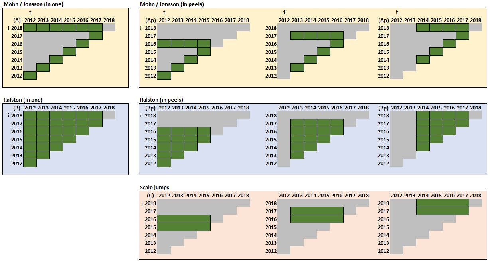

```{r, message=FALSE, warning=FALSE, include=FALSE}

# -----------------------------------------------------------------------------------------------
# Analyse changes in pelagic stocks.Rmd
#
# 07/01/2019 first coding; adapted from ICES advice and assessment summaries.Rmd
# 13/01/2019 now only figures and tables
# 15/01/2019 added scale jump figure with explanatory variables
# 22/02/2019 focussed on Pairwise Comparison of Means = scale jumps under different conditions
# -----------------------------------------------------------------------------------------------

require("knitr")
knitr::opts_chunk$set(echo = FALSE,	message = FALSE,	warning = FALSE,	comment = "",	crop = TRUE )
knitr::opts_chunk$set(fig.width=10) 
knit_hooks$set(crop = hook_pdfcrop)

# Libraries
library(tidyverse) # for piping and easy coding
library(reshape2)  # reshaping data; e.g. dcast
library(ggthemes)  # for themes
library(ggExtra)   # for specific type of plots e.g. ggMarginal
library(pander)    # for print tables
library(readxl)    # read excel files
library(cowplot)   # multiplots
library(RColorBrewer) # colours
library(lubridate)
library(scales)
library(directlabels)  # for printing labels at end of geom lines

# citations library
library(knitcitations) # use citations in rmarkdown
options("citation_format" = "pandoc")

# captioner library
library(captioner) # deal with captions
tab_nums <- captioner::captioner(prefix = "Table", levels=2, type=c("n","n"), infix=".")
fig_nums <- captioner::captioner(prefix = "Figure", levels=2, type=c("n","n"), infix=".")


# Load utils code
source("../../mptools/r/my_utils.r")

dropboxdir <- paste(get_dropbox(), "/iAdvice", sep="")

# Load dataset
load(file=paste(dropboxdir, "/rdata/iAssess.RData",sep=""))
load(file=paste(dropboxdir, "/rdata/iAdvice.RData",sep=""))

# Create subset of series (stocks) to be used for analysis
d <-
  iAssess %>%
  
  # filter stocks
  filter(grepl("ple-n|her-47|mac-67|mac-nea|mac-west|cod-34|cod-nsea|whb-c|whb-n|sol-ns|hom-c|hom-w|had-3|had-n|hke-n", stockkeylabelold)) %>%
  
  mutate(
    stock = as.character(NA),
    stock = ifelse(grepl("ple-n",stockkeylabelold), "ple (north sea)",stock),
    stock = ifelse(grepl("her-4",stockkeylabelold), "her (north sea)",stock),
    stock = ifelse(grepl("mac-67|mac-nea|mac-west",stockkeylabelold), "mac (west)",stock),
    stock = ifelse(grepl("cod-34|cod-nsea",stockkeylabelold), "cod (north sea)",stock),
    stock = ifelse(grepl("whb-c|whb-n",stockkeylabelold), "whb (comb)",stock),
    stock = ifelse(grepl("sol-ns",stockkeylabelold), "sol (north sea)",stock),
    stock = ifelse(grepl("hom-c|hom-w",stockkeylabelold), "hom (west)",stock),
    stock = ifelse(grepl("had-3|had-n",stockkeylabelold), "had (north sea)",stock),
    stock = ifelse(grepl("hke-n",stockkeylabelold), "hke (north)",stock)
  ) %>% 
  
  # Exclude prediction years (but keep the benchmark information that has no year attached to it)
  filter(is.na(year) | (year <= assessmentyear & year >= 1980) ) %>% 
  filter(assessmentyear >= 1982) %>% 
  filter(is.na(year) | !(is.na(stocksize) & is.na(fishingpressure))) %>% 
  
  # Only assessments with stock size in tonnes
  filter(is.na(year) |stocksizeunits  == "tonnes") %>%  
  
  # Sorting
  arrange(stock, purpose, desc(assessmentyear)) %>% 
  
  select(assessmentyear, year, stock, stockkeylabelold, purpose, benchmark,
         stocksize, recruitment, fishingpressure) %>% 
  distinct() %>% 
  gather(key=variable, value=value, stocksize:fishingpressure) %>% 
  filter(is.na(year) | (!is.na(value) & value != 0.0) )  %>% 
  
  # Keep this variable
  filter( variable %in% c("stocksize")) %>% 

  arrange(stock, variable, (assessmentyear)) %>% 
  ungroup() %>% 
  
  mutate(plot=ifelse(assessmentyear == max(assessmentyear), "last", "other"))


# write.csv(distinct(d,stock), "temp.csv")

# Data handling ===========================================================================


# select data
d.selection <-
  d %>%
  filter(purpose == "advice") %>% 
  filter(!is.na(year))

# benchmark data
d.benchmarks <-
  d %>% 
  filter(benchmark == TRUE) %>% 
  distinct(stock, stockkeylabelold, assessmentyear, .keep_all = FALSE) %>% 
  mutate(benchmark = 1)


# assessment data
d.assessments <-
  d.selection %>% 
  distinct(stock, stockkeylabelold, assessmentyear, purpose, .keep_all = FALSE) %>% 

  left_join(iAdvice, by=c("stockkeylabelold","assessmentyear", "purpose")) %>%
  select(-benchmark) %>% 
  mutate(assessmentmodel = tolower(assessmentmodel)) %>% 
  
  distinct(stock, stockkeylabelold, assessmentyear, purpose, benchmark, assessmentmodel, 
           ncpueseries, nsurveyseries, .keep_all = FALSE) %>%
  
  # determine stock definition change and model definition change
  arrange(stock, assessmentyear) %>% 
  group_by(stock) %>% 
  mutate(
    assessmentmodelchange = ifelse(assessmentmodel != lead(assessmentmodel), 2, 0),
    assessmentmodelchange = ifelse(assessmentmodel != lag(assessmentmodel) , 1, assessmentmodelchange),
    assessmentmodelchange = ifelse(assessmentmodel != lag(assessmentmodel) & 
                                   assessmentmodel != lead(assessmentmodel), 3, assessmentmodelchange),

    # add first and last year to stock definitions
    assessmentmodelchange = 
      case_when(
        assessmentyear == min(assessmentyear) & assessmentmodel != lead(assessmentmodel)  ~ 3, 
        assessmentyear == min(assessmentyear) & assessmentmodel == lead(assessmentmodel)  ~ 1,
        assessmentyear == max(assessmentyear) & assessmentmodel != lag(assessmentmodel) ~ 3, 
        assessmentyear == max(assessmentyear) & assessmentmodel == lag(assessmentmodel) ~ 2,
        TRUE ~ assessmentmodelchange
      ) 
    ) %>% 
  
  # stock definition change
  mutate(
    stockdefinitionchange = ifelse(stockkeylabelold != lead(stockkeylabelold), 2, 0),
    stockdefinitionchange = ifelse(stockkeylabelold != lag(stockkeylabelold), 1, stockdefinitionchange),
    stockdefinitionchange = ifelse(is.na(stockdefinitionchange), 0, stockdefinitionchange),
    
    # add first and last year to stock definitions
    stockdefinitionchange = ifelse(assessmentyear == min(assessmentyear), 1, stockdefinitionchange),
    stockdefinitionchange = ifelse(assessmentyear == max(assessmentyear), 2, stockdefinitionchange) 

  ) %>% 
  #     ifelse(assessmentyear == min(assessmentyear), 1, stockdefinitionchange),
  #   stockdefinitionchange = ifelse(assessmentyear == max(assessmentyear), 2, stockdefinitionchange) 

  # benchmarks
  full_join(d.benchmarks, by=c("stock", "stockkeylabelold", "assessmentyear")) %>% 
  # left_join(d.benchmarks, by=c("stock", "stockkeylabelold", "assessmentyear")) %>% 
  mutate(benchmark = ifelse(is.na(benchmark), 0, benchmark))

# dataset with stock definition changes
d.stockdefinitionchange <-
  d.assessments %>% 
  filter(stockdefinitionchange >= 1) %>% 
  distinct(stock, stockkeylabelold, assessmentyear, stockdefinitionchange, .keep_all = FALSE) %>% 
  
  group_by(stock, stockkeylabelold) %>% 
  summarize(tmp = paste(assessmentyear, collapse="_")) %>% 
  separate(tmp, into=c("y1","y2"), sep="_") %>% 
  mutate_at(c("y1","y2"), funs(as.numeric)) %>% 
  arrange(stock, y1) %>% 
  
  group_by(stock) %>% 
  mutate(rank = as.character(row_number()))

# dataset with assessment model periods
d.assessmentmodels3 <-
  d.assessments %>% 
  filter(assessmentmodelchange == 3) %>% 
  distinct(stock, assessmentyear, assessmentmodel, assessmentmodelchange, 
           .keep_all = FALSE) %>% 
  mutate(y1 = assessmentyear, y2 = assessmentyear+0.8) %>% 
  ungroup() %>% 
  select(-assessmentyear, -assessmentmodelchange)
  
d.assessmentmodels <-
  d.assessments %>% 
  filter(assessmentmodelchange %in% 1:2) %>% 
  distinct(stock, assessmentyear, assessmentmodel, assessmentmodelchange, 
           .keep_all = FALSE) %>% 
  
  group_by(stock, assessmentmodel) %>% 
  summarize(tmp = paste(assessmentyear, collapse="_")) %>% 
  separate(tmp, into=c("y1","y2"), sep="_") %>% 
  mutate_at(c("y1","y2"), funs(as.numeric)) %>% 
  mutate(y2 = y2 +0.8) %>% 
  
  # add the single year assessments
  bind_rows(d.assessmentmodels3) %>% 
  
  arrange(stock, y1) %>% 
  
  group_by(stock) %>% 
  mutate(rank = as.character(row_number()))

# most recent assessments
d.recent <-
  d.selection %>% 
  filter(assessmentyear == 2018) %>% 
  ungroup() %>% 
  select(year, stock, purpose, variable, value_last=value)

# segments to endpoints
d.segment <-
  d.selection %>% 
  filter( (assessmentyear != 2018 & year == max(year)) ) %>% 
  
  # add the most recent assessment data
  left_join(d.recent, by=c("year", "stock", "purpose", "variable")) %>% 
  arrange(stock, desc(year)) 

# endpoints
d.points <-
  d.selection %>% 
  filter( (assessmentyear != 2018 & year == max(year)) ) 

# CALCULATE IN ONE

# Mohn's and Jonsson's metrics all compared to the most recent assessment

d.mohnjonsson <-
  
  d.selection %>% 
  
  group_by(stock, assessmentyear, variable) %>% 
  arrange(stock, variable, desc(assessmentyear)) %>% 

  # remove most recent year 2018 and keep only endpoints
  filter( (assessmentyear != 2018 & year == max(year)) ) %>% 
  
  filter( variable == "stocksize") %>% 
  filter( year >= 1980) %>%

  # add the most recent assessment data
  left_join(d.recent, by=c("year", "stock", "purpose", "variable")) %>% 
  
  # calculate metrics
  mutate(jonsson_ab  = log(value/value_last),
         mohn_rho    = ((value - value_last) / value_last),
         mohn_rhoabs= abs(mohn_rho)) %>% 

  group_by(stock, variable) %>% 
  mutate(jonsson_dev  = (log(value/value_last) - mean(jonsson_ab)),
         jonsson_dev2 = (jonsson_dev)^2,
         jonsson_asd  = abs(jonsson_dev)) %>% 
  
  mutate(calctype = "in_one")


# Calculations by stock

d.mohnjonsson.bystock <-
  d.mohnjonsson %>% 
  
  group_by(stock, variable, calctype) %>% 
  summarize(jonsson_ab   = mean(jonsson_ab),
            jonsson_asd  = sqrt(mean(jonsson_dev2)),
            mohn_rhoabs = mean(mohn_rhoabs),
            mohn_rho     = mean(mohn_rho), 
            firstyear    = min(year, na.rm=TRUE),
            lastyear     = max(year, na.rm=TRUE)) 


# Calculate Ralston's retrospective measures

d.ralston <-
  
  d.selection %>% 

  arrange(stock, year, assessmentyear) %>% 
  group_by(stock, year) %>%
  
  filter(n() >= 2) %>% 
  
  mutate(logB     = log(value),
         meanlogB = mean(log(value), na.rm=TRUE),
         logBdev  = logB - meanlogB,
         logBdev2 = (logBdev)^2,
         n        = n(),
         n_1      = n - 1) %>% 
  
  # now do summing over years
  mutate(sumlogBdev2 = sum(logBdev2), na.rm=TRUE ) %>% 
  
  # now summarize by year
  summarize(
    meanlogBdev = mean(logBdev, na.rm=TRUE),
    sumlogBdev2 = sum(logBdev2, na.rm=TRUE),
    n_1         = mean(n_1, na.rm=TRUE), 
    ralston_sigma = sqrt(sumlogBdev2/n_1)) %>% 
  
  mutate(calctype = "in_one")
  

# Calculate by stock

d.ralston.bystock <-
  d.ralston %>% 
  
  group_by(stock, calctype) %>%
  distinct(stock, year, n_1, sumlogBdev2, .keep_all = FALSE) %>% 
  summarize(
    sumlogBdev2all = sum(sumlogBdev2),
    n_1            = sum(n_1), 
    firstyear    = min(year, na.rm=TRUE),
    lastyear     = max(year, na.rm=TRUE)
  ) %>%
  
  # calculate overall metrics
  mutate(
    ralston_sigma = sqrt(sumlogBdev2all / n_1),
    cv            = percent(sqrt(exp(ralston_sigma^2)-1))
  )


# CALCULATE IN PEELS


# create meta data on peels
d.peels <-
  d.selection %>% 
  distinct(stock, assessmentyear, variable) %>% 
  group_by(stock, variable) %>% 
  arrange(stock, variable, assessmentyear) %>% 
  mutate(assessmentyear_0   = assessmentyear,
         assessmentyear_1   = lag(assessmentyear, n=1),
         assessmentyear_2   = lag(assessmentyear, n=2),
         assessmentyear_3   = lag(assessmentyear, n=3),
         assessmentyear_4   = lag(assessmentyear, n=4),
         assessmentyear_5   = lag(assessmentyear, n=5),
         assessmentyear_6   = lag(assessmentyear, n=6),
         assessmentyear_7   = lag(assessmentyear, n=7),
         assessmentyear_8   = lag(assessmentyear, n=8),
         assessmentyear_9   = lag(assessmentyear, n=9),
         assessmentyear_10   = lag(assessmentyear, n=10)
         ) %>% 
  rename(assessmentyearbase = assessmentyear) %>%
  gather(key=peel, value=assessmentyear, assessmentyear_0:assessmentyear_10) %>% 
  mutate(peel = as.integer(str_extract(peel, "[[:digit:]]+"))) %>% 
  arrange(stock, assessmentyearbase, variable, peel, assessmentyear) %>% 
  filter(!is.na(assessmentyear)) %>% 
  
  group_by(stock, assessmentyearbase, variable) %>%
  mutate(maxpeel = max(peel)) %>% 
  ungroup()

# Create datasets with peels

d.inpeels <-
  d.peels %>% 
  left_join(d.selection, by=c("stock", "assessmentyear", "variable")) %>%
  arrange(stock, desc(assessmentyearbase), variable, desc(year), peel) %>% 
  group_by(stock, assessmentyearbase, variable, peel)  %>% 
  arrange(stock, variable, desc(assessmentyearbase), peel, desc(assessmentyear), desc(year)) 

# settings for number of years in peels

minnumberofyearsinpeel <- 5
maxnumberofyearsinpeel <- 5

# Calculate Mohn and Jonsson's retrospective metrics in peels

d.mohnjonsson_inpeels <-
  
  d.inpeels %>% 
  
  filter( (peel != 0 & year == max(year)) ) %>% 
  filter(peel <= maxnumberofyearsinpeel, maxpeel >= minnumberofyearsinpeel) %>% 
  
  # add the most recent estimates of the specific endyears
  left_join(select(d.selection, stock, assessmentyearbase=assessmentyear, year, purpose, 
                   variable, value_last=value),
            by=c("stock","assessmentyearbase","year","purpose","variable")) %>% 
  
  group_by(stock, assessmentyearbase, variable, year) %>% 
  arrange(stock, desc(assessmentyearbase), variable, desc(year)) %>% 
  mutate(jonsson_ab  = log(value/value_last),
         mohn_rho    = ((value - value_last) / value_last),
         mohn_rhoabs= abs(mohn_rho)) %>% 

  group_by(stock, assessmentyearbase, variable) %>% 
  mutate(jonsson_dev  = (log(value/value_last) - mean(jonsson_ab)),
         jonsson_dev2 = (jonsson_dev)^2 ,
         jonsson_asd  = abs(jonsson_dev)) %>% 

  summarize(jonsson_ab   = mean(jonsson_ab),
            jonsson_asd  = sqrt(mean(jonsson_dev2)),
            mohn_rhoabs = mean(mohn_rhoabs),
            mohn_rho     = mean(mohn_rho) ) %>% 
  
  mutate(calctype = "in_peels")

# Average by stock
d.mohnjonsson_inpeels.bystock <-
  d.mohnjonsson_inpeels %>% 
  group_by(stock, variable, calctype) %>% 
  summarize(jonsson_ab   = mean(jonsson_ab),
            jonsson_asd  = mean(jonsson_asd),
            mohn_rhoabs = mean(mohn_rhoabs),
            mohn_rho     = mean(mohn_rho), 
            firstyear    = min(assessmentyearbase),
            lastyear     = max(assessmentyearbase) ) 


# Calculate adapted Ralston's retrospective measures in peels

d.ralston_inpeels <-
  
  d.inpeels %>% 
  
  # filter(year >= assessmentyearbase - 20) %>%
  filter(year >= assessmentyearbase - maxnumberofyearsinpeel, maxpeel >= minnumberofyearsinpeel) %>% 

  group_by(stock, assessmentyearbase, variable, year) %>%
  arrange(stock, desc(assessmentyearbase), desc(year) ) %>% 
           
  filter(n() >= 2) %>% 
  
  mutate(logB     = log(value),
         meanlogB = mean(log(value)),
         logBdev  = logB - meanlogB,
         logBdev2 = (logBdev)^2,
         n        = n(),
         n_1      = n - 1) %>% 
  
  # now do summing over years by assessmentyearbase
  mutate(sumlogBdev2 = sum(logBdev2) ) %>% 

  # summarize over years
  summarize(
    meanlogBdev = mean(logBdev),
    sumlogBdev2 = sum(logBdev2),
    n_1         = mean(n_1), 
    avglogBdev2 = sumlogBdev2/n_1, 
    ralston_sigma = sqrt(sumlogBdev2/n_1)) %>% 

  group_by(stock, assessmentyearbase, variable) %>%
  distinct(stock, assessmentyearbase, variable, year, n_1, sumlogBdev2, .keep_all = FALSE) %>% 
  summarize(
    sumlogBdev2all = sum(sumlogBdev2),
    n_1            = sum(n_1)) %>%
  
  # calculate overall metrics
  mutate(
    ralston_sigma = sqrt(sumlogBdev2all / n_1),
    cv            = percent(sqrt(exp(ralston_sigma^2)-1))) %>% 
  
  mutate(calctype = "in_peels")

# Average over assessmentyearbase
d.ralston_inpeels.bystock <-
  d.ralston_inpeels %>% 
  group_by(stock, variable, calctype) %>% 
  summarize(ralston_sigma = mean(ralston_sigma), 
  firstyear               = min(assessmentyearbase),
  lastyear                = max(assessmentyearbase))


# combine the metric by year
d.metrics_annual <-
  bind_rows(d.mohnjonsson, d.ralston) %>% 
  bind_rows(select(d.mohnjonsson_inpeels, 
                   year = assessmentyearbase, stock, variable, calctype,
                   jonsson_ab, jonsson_asd, mohn_rho, mohn_rhoabs)) %>% 
  bind_rows(select(d.ralston_inpeels,
                   year = assessmentyearbase, stock, variable, calctype,
                   ralston_sigma)) %>% 
  ungroup() %>% 
  select(calctype, stock, year, jonsson_ab, jonsson_asd, mohn_rho, ralston_sigma) %>% 
  gather(key=metric, value=value, jonsson_ab:ralston_sigma) %>%
  filter(!is.na(value)) %>% 
  separate(metric, into=c("author", "metric"), by="_") %>%
  group_by(calctype, stock, author, metric, year) %>% 
  mutate(n=n(),
         stock2 = substr(stock,1,3)) 

# combine the metrics by stock
d.metrics_bystock <-
  bind_rows(d.mohnjonsson.bystock, d.ralston.bystock) %>% 
  bind_rows(select(d.mohnjonsson_inpeels.bystock, 
                   stock, variable, calctype, firstyear, lastyear, 
                   jonsson_ab, jonsson_asd, mohn_rho, mohn_rhoabs)) %>% 
  bind_rows(select(d.ralston_inpeels.bystock,
                   stock, variable, calctype, firstyear, lastyear, 
                   ralston_sigma)) %>% 
  ungroup() %>% 
  select(calctype, stock, firstyear, lastyear, jonsson_ab, jonsson_asd, mohn_rho, ralston_sigma) %>% 
  gather(key=metric, value=value, jonsson_ab:ralston_sigma) %>%
  filter(!is.na(value)) %>% 
  separate(metric, into=c("author", "metric"), by="_") %>%
  group_by(calctype, stock, author, metric) %>% 
  mutate(stock2 = substr(stock,1,3)) 


# Calculations of Pairwise Comparison of Mean and scale jumps ==========================================

pairwise_comparisons <- function(removelastyears=0, numberofyears=10) {
  
  # Create a set of assessment pairs: two subsequent assessments  
  d.pairs <-
    d.selection %>% 
    distinct(stock, assessmentyear, variable) %>% 
    group_by(stock, variable) %>% 
    arrange(stock, variable, assessmentyear) %>% 
    mutate(assessmentyearprior = lag(assessmentyear),
           assessmentpair      = paste(assessmentyearprior, assessmentyear, sep="-")) %>% 
    rename(assessmentyearlast  = assessmentyear) %>% 
    filter(!is.na(assessmentyearprior))
  
  # data series with most recent (last) estimation of the pair
  d.pairs.last <-
    d.pairs %>% 
    select(-assessmentyearprior) %>% 
    left_join(d.selection, by=c("stock", "variable", "assessmentyearlast" = "assessmentyear")) %>% 
    mutate(label="last") %>% 
    rename(assessmentyear = assessmentyearlast)
  
  # data series with previous (prior) estimation of the pair
  d.pairs.prior <-
    d.pairs %>% 
    select(-assessmentyearlast) %>% 
    left_join(d.selection, by=c("stock", "variable", "assessmentyearprior" = "assessmentyear")) %>% 
    mutate(label="prior") %>% 
    rename(assessmentyear = assessmentyearprior)
  
  
  # pairwise data roughly
  d.pairwise.roughly <-
    bind_rows(d.pairs.last, d.pairs.prior) %>% 
    group_by(stock, assessmentpair, variable) %>% 
    
    # filter the appropriate period
    filter(year <= max(assessmentyear) - removelastyears,
           year >= max(assessmentyear) - removelastyears - numberofyears -5) 
  
  # pairwise data
  d.pairwise <-
    d.pairwise.roughly %>% 
    group_by(stock, assessmentpair, variable) %>% 
    
    # filter the appropriate period
    filter(year <= max(assessmentyear) - removelastyears,
           year >= max(assessmentyear) - removelastyears - numberofyears) %>% 
    
    # sort
    arrange(stock, assessmentpair, assessmentyear, year) %>% 
  
    # filter only years that are in common in last and prior
    group_by(stock, assessmentpair, variable, year) %>% 
    mutate(n = n()) %>% 
    filter(n() == 2) 
  

  d.pcm <-
    d.pairwise %>% 
    
    # calculate means per period
    group_by(stock, assessmentpair, variable) %>% 
    mutate(   firstyear      = min(year),
              lastyear       = max(year)) %>% 
    group_by(stock, assessmentpair, variable, assessmentyear, label, firstyear, lastyear) %>% 
    summarise(value = mean(value, na.rm=TRUE)) %>% 
    gather(key=tmp, value=year, firstyear:lastyear) %>% 
    arrange(stock, assessmentpair, variable, assessmentyear, label) %>% 
  
    # calculate metrics
    filter(tmp=="firstyear") %>% 
    ungroup() %>% 
    select(stock, assessmentpair, variable, label, value) %>% 
    spread(key=label, value=value) %>% 
    mutate(phi            = (prior-last)/last,
           phi_abs        = abs(phi),
           assessmentyear = as.integer(substr(assessmentpair, 6,9))) 
  
  res <- list("d.pcm"= d.pcm, 
              "d.pairwise.roughly"=d.pairwise.roughly,
              "d.pairwise" =d.pairwise)
  
  return(res)

} # End of pairwise_comparisons function

tmp <- pairwise_comparisons(removelastyears = 0, numberofyears=5)


# REMOVE FROM HERE !!

removelastyears <- 0
numberofyears   <- 10
threshold       <- 0.1   # threshold for scale differences

# Create a set of assessment pairs: two subsequent assessments  
d.pairs <-
  d.selection %>% 
  distinct(stock, assessmentyear, variable) %>% 
  group_by(stock, variable) %>% 
  arrange(stock, variable, assessmentyear) %>% 
  mutate(assessmentyearprior = lag(assessmentyear),
         assessmentpair      = paste(assessmentyearprior, assessmentyear, sep="-")) %>% 
  rename(assessmentyearlast  = assessmentyear) %>% 
  filter(!is.na(assessmentyearprior))

# data series with most recent (last) estimation of the pair
d.pairs.last <-
  d.pairs %>% 
  select(-assessmentyearprior) %>% 
  left_join(d.selection, by=c("stock", "variable", "assessmentyearlast" = "assessmentyear")) %>% 
  mutate(label="last") %>% 
  rename(assessmentyear = assessmentyearlast)

# data series with previous (prior) estimation of the pair
d.pairs.prior <-
  d.pairs %>% 
  select(-assessmentyearlast) %>% 
  left_join(d.selection, by=c("stock", "variable", "assessmentyearprior" = "assessmentyear")) %>% 
  mutate(label="prior") %>% 
  rename(assessmentyear = assessmentyearprior)


# pairwise data roughly
d.pairwise.roughly <-
  bind_rows(d.pairs.last, d.pairs.prior) %>% 
  group_by(stock, assessmentpair, variable) %>% 
  
  # filter the appropriate period
  filter(year <= max(assessmentyear) - removelastyears,
         year >= max(assessmentyear) - removelastyears - numberofyears -5) 

# pairwise data
d.pairwise <-
  d.pairwise.roughly %>% 
  group_by(stock, assessmentpair, variable) %>% 
  
  # filter the appropriate period
  filter(year <= max(assessmentyear) - removelastyears,
         year >= max(assessmentyear) - removelastyears - numberofyears) %>% 
  
  # sort
  arrange(stock, assessmentpair, assessmentyear, year) %>% 

  # filter only years that are in common in last and prior
  group_by(stock, assessmentpair, variable, year) %>% 
  mutate(n = n()) %>% 
  filter(n() == 2) 
  

d.jumps <-
  d.pairwise %>% 
  
  # calculate means per period
  group_by(stock, assessmentpair, variable) %>% 
  mutate(   firstyear      = min(year),
            lastyear       = max(year)) %>% 
  group_by(stock, assessmentpair, variable, assessmentyear, label, firstyear, lastyear) %>% 
  summarise(value = mean(value, na.rm=TRUE)) %>% 
  gather(key=tmp, value=year, firstyear:lastyear) %>% 
  arrange(stock, assessmentpair, variable, assessmentyear, label) %>% 

  # calculate metrics
  filter(tmp=="firstyear") %>% 
  ungroup() %>% 
  select(stock, assessmentpair, variable, label, value) %>% 
  spread(key=label, value=value) %>% 
  mutate(phi            = (prior-last)/last,
         phi_abs        = abs(phi),
         assessmentyear = as.integer(substr(assessmentpair, 6,9))) 


# CONTINUE FROM HERE

# calculate average jump per stock
d.jumps.bystock <-
  d.jumps %>% 
  group_by(stock, variable) %>% 
  summarize(
    pastoors_njumps    = sum(phi_abs > threshold),
    pastoors_percjumps = pastoors_njumps / n(),
    pastoors_phi       = mean(phi),
    pastoors_phiabs    = mean(phi_abs), 
    firstyear          = min(assessmentyear),
    lastyear           = max(assessmentyear),
    calctype           = "in_peels")

# jumps by decade
d.jumps.bydecade <-
  d.jumps %>% 
  mutate(    decade = as.character(10*floor(assessmentyear/10)) ) %>% 
  group_by(stock, variable, decade) %>% 
  summarise(n         = n(),
            n2        = sum(phi_abs > 0.1, na.rm=TRUE),
            phi     = mean(phi, na.rm=TRUE),
            phi_abs = mean(phi_abs, na.rm=TRUE)
  ) %>%
  mutate(phi_abs    = percent_format(accuracy=1)(phi_abs),
         ratio        = paste(n2,n,sep="/"),
         ratio2       = percent_format(accuracy=1) (n2/n),
         ratio3       = paste(ratio2," (", n, ")", sep="") ) 

# jumps by year
d.jumps.byyear <-
  d.jumps %>% 
  group_by(variable, assessmentyear) %>% 
  summarise(n         = n(),
            n2        = sum(phi_abs > 0.1, na.rm=TRUE)) %>% 
  mutate(ratio = n2 / n )

            
# update d.metrics_bystock
d.metrics_bystock2 <-
  bind_rows(d.mohnjonsson.bystock, d.ralston.bystock) %>% 
  bind_rows(select(d.mohnjonsson_inpeels.bystock, 
                   stock, variable, calctype, firstyear, lastyear, 
                   jonsson_ab, jonsson_asd, mohn_rho, mohn_rhoabs)) %>% 
  bind_rows(select(d.ralston_inpeels.bystock,
                   stock, variable, calctype, firstyear, lastyear, 
                   ralston_sigma)) %>% 
  bind_rows(select(d.jumps.bystock,
                   stock, variable, calctype, firstyear, lastyear, 
                   pastoors_njumps, pastoors_percjumps, pastoors_phi, pastoors_phiabs)) %>% 
  ungroup() %>% 
  select(calctype, stock, firstyear, lastyear, jonsson_ab, jonsson_asd, mohn_rho, mohn_rhoabs, ralston_sigma,
         pastoors_njumps, pastoors_percjumps, pastoors_phi, pastoors_phiabs) %>% 
  gather(key=metric, value=value, jonsson_ab:pastoors_phiabs) %>%
  filter(!is.na(value)) %>% 
  separate(metric, into=c("author", "metric"), by="_") %>%
  group_by(calctype, stock, author, metric) %>% 
  mutate(stock2 = substr(stock,1,3)) 


# Compare scale jumps when stock definition has changed.

t <-
  d %>% 
  select(assessmentyear, stock, stockkeylabelold) %>% 
  distinct() %>% 
  mutate(
    stock = factor(stock),
    stock = factor(stock, levels=rev(levels(stock)))) %>% 
  group_by(stock, stockkeylabelold) %>% 
  summarize(
    firstyear = min(assessmentyear),
    lastyear  = max(assessmentyear)) %>% 
  arrange(stock, firstyear) %>% 
  group_by(stock) %>% 
  mutate(
    previous       = lag(lastyear),
    assessmentpair = paste(previous, firstyear, sep="-"),
    stockold       = lag(stockkeylabelold)) %>% 
  filter(!is.na(previous))  %>% 
  select(stock, assessmentpair) 

t1 <-
  t %>% 
  left_join(d.pairs, by=c("stock", "assessmentpair")) %>% 
  select(-assessmentyearprior) %>% 
  left_join(d, by=c("stock", "variable", "assessmentyearlast" = "assessmentyear")) %>% 
  mutate(label="after") %>% 
  rename(assessmentyear = assessmentyearlast)

# data series with previous (prior) estimation
t2 <-
  t %>% 
  left_join(d.pairs, by=c("stock", "assessmentpair")) %>% 
  select(-assessmentyearlast) %>% 
  left_join(d, by=c("stock", "variable", "assessmentyearprior" = "assessmentyear")) %>% 
  mutate(label="before") %>% 
  rename(assessmentyear = assessmentyearprior)

# combine
t3 <-
  bind_rows(t2, t1) %>% 
  group_by(stock, assessmentpair, variable) %>% 
  
  # filter the appropriate period
  filter(year <= max(assessmentyear) - removelastyears,
         year >= max(assessmentyear) - removelastyears - numberofyears) %>% 
  
  # sort
  arrange(stock, assessmentpair, assessmentyear, year) %>% 

  # filter only years that are in common in last and prior
  group_by(stock, assessmentpair, variable, year) %>% 
  mutate(
    n = n(),
    header = paste(stock, assessmentpair, sep=" ")
  ) %>% 
  filter(n() == 2) 


# Captions used in this document ==========================================================

# section 1 -----------------------------------------------------

tab_nums(name    = "section1", level = 1, display = FALSE)

fig_nums(name    = "stockdefinitions", level = 1, display = FALSE,
         caption = "Definitions of stocks (by year) that have been ‘lumped’ into meta-stocks for long time-series")

fig_nums(name    = "differentmethods", level = 2, display = FALSE, 
         caption = "Comparison of three different types of retrospective metrics. t refers to the year for a stock metric X, i refers to the assessment year. Diagram A is applicable to Mohn’s rho and Jonsson and Hjorleifsson’s retrospective metrics while Ap refers to the same metrics calculated in peels (in this example of 4 years), B refers to Ralston’s et al metrics and Bp to the same metrics in peels and C refers to the scale differences calculated in this example over 4 years (this paper)")

fig_nums(name    = "retroplots", level = 2, display = FALSE, 
         caption = "Historic retrospective analysis of the nine stocks analysed. For each stock, the most recent assessment is in red and the previous assessments in black. The end point of each assessment is indicated by a dot. Stock definitions may have changed over time, but this is not included in the graphs")

# section2 -----------------------------------------------------

tab_nums(name    = "section2", level = 1, display = FALSE)

fig_nums(name    = "retrometrics", level = 1, display = FALSE, 
         caption = " Retrospective metrics for 9 species derived from historical assessment records. Metrics ab (average bias) and asd (average variation) from Jonsson & Hjorleifsson 2000, rho from Mohn 1999 and sigma from Ralston et al 2011. In red: calculated values based on the whole time-series of historical data. In blue: based on retrospective peels of 5 years. Metrics ab, asd and sigma on a log scale, rho on a ratio scale.")

fig_nums(name    = "retrometrics2", level = 2, display = FALSE, 
         caption = "Summary of retrospective metrics for 9 species derived from historical assessment records. Metrics ab (average bias) and asd (average variation) from Jonsson & Hjorleifsson 2000, rho from Mohn 1999 and sigma from Ralston et al 2011. In red: calculated values based on the whole time-series of historical data. In blue: based on retrospective peels of 5 years. Metrics ab, asd and sigma on a log scale, rho on a ratio scale.")

# section 3 -----------------------------------------------------

tab_nums(name    = "scalejumps", level = 1, display = FALSE, 
         caption = "Percentage assessments with scale jumps of more than 10% expressed by decade. Between brackets: number of assessments within the decade.")

fig_nums(name    = "scalecomparisons", level = 1, display = FALSE, 
         caption = "Example of pairwise assessment comparisons for Northeast Atlantic mackerel  over a period of 10 years in common. The dotted lines indicate the average values of the different assessments which are used to calculate scale differences between assessments.")

fig_nums(name    = "scalejumps", level = 2, display = FALSE, 
         caption = "Retrospective scale difference (sigma) for 9 species derived from historical assessment records. Results from pairwise comparisons over periods of 10 years. Large dots  refer to years when the scale difference is larger than 10%. Colours indicate the decades. Black triangles indicate benchmark assessment years. The bottom part of the panels shows the assessment methods being deployed, the upper part of the panels the stock definitions.")

fig_nums(name    = "metricsinpeels", level = 2, display = FALSE, 
         caption = "Comparison of retrospective uncertainty metrics from historical assessment records, calculated in peels, normalized between 0 and 1. Asd from Jonsson & Hjorleifsson 2000, rhoabs as absolute value of rho from Mohn 1999, sigma from Ralston et al 2011, percjumps as the percentage of jumps (this paper) and phiabs as the absolute value of phi (this paper).")

# section 4 -----------------------------------------------------

fig_nums(name    = "stockdefchange", level = 1, display = FALSE, 
         caption = "Comparisons of assessments (SSB) where stock definitions changed. Green is old stock definition, red is new stock definition")

fig_nums(name    = "jumpratio", level = 2, display = FALSE, 
         caption = "Ratio of scale-jumps in assessment relative to the number of assessment by year.")

getPalettePurples         <- colorRampPalette(brewer.pal(7, "Purples")[-(1:2)])
myPurples                 <- getPalettePurples(10)

getPaletteBlues         <- colorRampPalette(brewer.pal(7, "Blues")[-(1:2)])
myBlues                 <- getPaletteBlues(10)

```


**Scale-jumps: a new metric to describe historical retrospective patterns in ICES stock assessments**


<!-- Tables ------------------------------------------------------ -->

**Tables**

*`r tab_nums("scalejumps")`*

```{r}

# print table
d.jumps.bydecade %>% 
  filter(variable == "stocksize") %>% 
  ungroup() %>% 
  select(stock, decade, ratio3) %>% 
  spread(key=decade, value=ratio3) %>% 
  pandoc.table(.,
               style = "simple",
               split.tables=400, 
               justify = "left",
               missing=".",
               round=c(0,0,0,0,0,0,0,0,0,0,0,0,0,0,0,0,0,0,0,0)) 

```

<!-- Figures ------------------------------------------------------ -->

#####page break

**Figures**

<!-- ################################################################################## -->
<!-- Plot Stock definitions      ------------------------------------------------------ -->
<!-- ################################################################################## -->

```{r, echo=FALSE, fig.asp=0.7, fig.align="center", message=FALSE, warning=FALSE}

d %>% 
  select(assessmentyear, stock, stockkeylabelold) %>% 
  distinct() %>% 
  mutate(stock = factor(stock),
         stock = factor(stock, levels=rev(levels(stock)))) %>% 
  group_by(stock, stockkeylabelold) %>% 
  summarize(firstyear = min(assessmentyear),
            lastyear = max(assessmentyear)) %>% 

  ggplot(aes(x=assessmentyear, y=stock)) +
  theme_publication() +
  ggalt::geom_dumbbell(aes(xend = lastyear, x=firstyear, group=stock)) +
  geom_text(aes(x=firstyear, label=stockkeylabelold), hjust=0, nudge_y=0.15, size=3)

```

*`r fig_nums("stockdefinitions")`*

#####page break


<!-- ################################################################################## -->
<!-- Plot different methods of creating historical retrospectives --------------------- -->
<!-- ################################################################################## -->

```{r echo=FALSE, fig.align="center", fig.asp=0.7, message=FALSE, warning=FALSE}


  
```

*`r fig_nums("differentmethods")`*


#####Page break

<!-- Plot Retroplots --------------------------- -->

```{r, echo=FALSE, fig.asp=1.0, fig.align="center", message=FALSE, warning=FALSE}

# plot
d.selection %>%   
  ggplot(aes(x=year, y=value)) +
  theme_publication() +
  theme(
    panel.spacing.x = unit(1, "mm"),
    panel.spacing.y = unit(1, "mm"),
    strip.background = element_blank(),
    strip.text       = element_text(face="bold", hjust=0, margin = margin(2,0,2,0, "mm")),
    legend.position  = "none"
  ) +  
  
  # geom_boxplot(aes(group=year), outlier.shape=NA, colour="gray50", fill=NA) +
  geom_segment(data=d.segment, 
               aes(x=year, xend=year,y=value,yend=value_last), colour="gray", linetype="dashed", size=0.5) +
  geom_line(aes(colour = plot, size=plot, group=assessmentyear)) +
  geom_point(data=d.points) +
  scale_colour_manual(values=c(last = "red", other="black")) +
  scale_size_manual (values=c(last=1, other=0.5)) +
  expand_limits(y=0) +
  scale_y_continuous(breaks = pretty_breaks(),  labels = scales::scientific_format(digits=2)) +
  scale_x_continuous(breaks = pretty_breaks()) +
  labs(y="ssb (tonnes)") +
  facet_wrap(~stock, scales="free")


```

*`r fig_nums("retroplots")`*

#####Page break


<!-- ################################################################################## -->
<!-- Plot Retro metrics                                     --------------------------- -->
<!-- ################################################################################## -->

```{r eval=FALSE, fig.align="center", fig.asp=1.0, message=FALSE, warning=FALSE, include=FALSE}

## NOT SHOWN 

d.metrics_annual %>% 
  
  ggplot() +
  theme_publication() +
  theme(
    panel.spacing.x = unit(1, "mm"),
    panel.spacing.y = unit(1, "mm"),
    strip.background = element_blank(),
    strip.text.x     = element_text(face="bold", hjust=0, margin = margin(2,0,2,0, "mm")),
    strip.text.y     = element_text(angle = 0),
    axis.text.x      = element_text(angle = 90, vjust = 0.5), 
    legend.position  = "none"
  ) +  
  
  geom_hline(aes(yintercept=0), colour="gray", linetype="dashed") +
  # geom_line(aes(x=year, y = value, colour=calctype)) +
  
  geom_point(aes(x=year, y = value, colour=calctype), shape=1) +
  
  geom_segment(data=d.metrics_bystock, 
               aes(x=firstyear, xend=lastyear,y=value,yend=value, colour=calctype), size=1) +

  # geom_hline(data=d.metrics_bystock, aes(yintercept = value, colour=calctype), size=1) +
  
  scale_y_continuous(breaks=pretty_breaks()) +
  scale_x_continuous(breaks=pretty_breaks(n=4)) +
  labs(y="") +
  facet_grid(metric~stock2, scales="free_y")


```

*`r fig_nums("retrometrics")`*


#####Page break

<!-- ################################################################################## -->
<!-- Plot Summary of retro metrics                          --------------------------- -->
<!-- ################################################################################## -->

```{r eval=FALSE, fig.align="center", fig.asp=1.0, message=FALSE, warning=FALSE, include=FALSE}

## NOT SHOWN

d.metrics_bystock %>% 
  
  ggplot() +
  theme_publication() +
  theme(
    panel.spacing.x = unit(1, "mm"),
    panel.spacing.y = unit(1, "mm"),
    strip.background = element_blank(),
    strip.text.x     = element_text(face="bold", hjust=0, margin = margin(2,0,2,0, "mm")),
    strip.text.y     = element_text(angle = 0),
    axis.text.x      = element_text(angle = 90, vjust = 0.5), 
    legend.position  = "none"
  ) +  
  
  geom_hline(aes(yintercept=0), colour="gray", linetype="dashed") +

  geom_bar(aes(x=stock2, y = value, fill=calctype), stat="identity", position="dodge") +
  
  scale_y_continuous(breaks=pretty_breaks()) +
  # scale_x_continuous(breaks=pretty_breaks(n=4)) +
  labs(y="", x="") +
  facet_grid(metric~calctype, scales="free_y")


```

*`r fig_nums("retrometrics2")`*


#####Page break

<!-- ################################################################################## -->
<!-- Plot pairwise comparisons                                                          -->
<!-- ################################################################################## -->

```{r, echo=FALSE, fig.asp=0.7, fig.align="center", message=FALSE, warning=FALSE}

res <- pairwise_comparisons(removelastyears = 0, numberofyears=10)

myvar     <- "stocksize"
myspecies <- "mac"
firstyear <- 2008

d.pairwise.means <-
  
  res$d.pairwise %>% 
  
  filter(variable == myvar) %>% 
  filter(grepl(myspecies, stockkeylabelold)) %>% 
  filter(as.numeric(substr(assessmentpair,1,4)) >= firstyear) %>% 
  
  # calculate means per period
  group_by(stock, assessmentpair, variable) %>% 
  mutate(   firstyear      = min(year),
            lastyear       = max(year)) %>% 
  group_by(stock, assessmentpair, variable, assessmentyear, label, firstyear, lastyear) %>% 
  summarise(value = mean(value, na.rm=TRUE)) %>% 
  gather(key=tmp, value=year, firstyear:lastyear) %>% 
  arrange(stock, assessmentpair, variable, assessmentyear, label) 

res$d.pairwise %>% 
  
  filter(variable == myvar) %>% 
  filter(grepl(myspecies, stockkeylabelold)) %>% 
  filter(as.numeric(substr(assessmentpair,1,4)) >= firstyear) %>% 
  
  ggplot(aes(x=year, y=value, group=assessmentyear)) +
  theme_publication() +
  theme(
    panel.spacing.x = unit(1, "mm"),
    panel.spacing.y = unit(1, "mm"),
    strip.background = element_blank(),
    strip.text.x     = element_text(face="bold", hjust=0, margin = margin(1,0,0,0, "mm")),
    strip.text.y     = element_text(angle = 0),
   # axis.text.x      = element_text(angle = 90, vjust = 0.5), 
    legend.position  = "none"
  ) +  
  
  geom_line(data=filter(res$d.pairwise.roughly, 
                        variable == myvar, 
                        grepl(myspecies, stockkeylabelold),
                        as.numeric(substr(assessmentpair,1,4)) >= firstyear), size=0.5) +
  
  geom_line(aes(colour=factor(label)), size=1) +

  geom_line(data=d.pairwise.means, aes(x=year, y=value, colour=factor(label)), 
            linetype="dashed", lineend="butt") +
  geom_point(data=filter(d.pairwise.means, year==min(year)),
             aes(colour=factor(label)), size=1) +
  geom_point(data=filter(d.pairwise.means, year==max(year)),
             aes(colour=factor(label)), size=1) +
  
  scale_y_continuous(breaks = pretty_breaks(n=3), labels=scientific_format(digits=1)) +
  scale_x_continuous(breaks = pretty_breaks(n=2)) +
  expand_limits(y=0) +
  labs(x="", y="ssb (tonnes)") +
  facet_wrap( ~ assessmentpair, scales = "free_x", ncol=5)

```

*`r fig_nums("scalecomparisons")`*


#####Page break

<!-- ################################################################################## -->
<!-- Plot pairwise comparison means                                                     -->
<!-- ################################################################################## -->

```{r eval=FALSE, fig.align="center", fig.asp=1.0, message=FALSE, warning=FALSE, include=FALSE}

res <- pairwise_comparisons(removelastyears = 0, numberofyears=10)

threshold <- 0.10

# plot scale jumps between assessments
res$d.pcm %>% 
  distinct(stock, variable, assessmentyear, phi) %>%
  mutate(    decade = as.character(10*floor(assessmentyear/10)) ) %>% 
  gather(key=metric, value=value, c(phi)) %>% 
  
  ggplot(aes(x=assessmentyear, y=value, group=stock)) +
  theme_publication() +
  theme(
    panel.spacing    = unit(0.1, "lines"),
    panel.grid.major.x = element_line(colour = "gray80"),
    strip.background = element_blank(),
    strip.text.x     = element_text(face="bold", hjust=0, margin = margin(2,0,2,0, "mm")),
    strip.text.y     = element_text(face="bold", hjust=0, margin = margin(2,0,2,0, "mm"), angle = 180),
    strip.placement = "outside",
    legend.position  = "none"
  ) +
  
  geom_rect(data=filter(d.stockdefinitionchange),
            aes(xmin = y1, xmax=y2, ymin = -1.0, ymax=1.0, fill=rank), 
            alpha=0.4, colour=myPurples[6], inherit.aes = FALSE) +
  
  geom_dl(data=filter(d.stockdefinitionchange),
          aes(label  = stockkeylabelold, x = y1, y = -0.95),
          method = list(dl.combine("first.points"), rot = 90, cex = 0.6, hjust=0.0, vjust=0.9),
          inherit.aes = FALSE, colour=brewer.pal(6, "Purples")[6]) +
  
  geom_hline(aes(yintercept = threshold), colour="gray80", linetype="dashed", size=0.5) +
  geom_hline(aes(yintercept = 0), colour="gray20", size=0.5) +
  geom_hline(aes(yintercept = -threshold), colour="gray80", linetype="dashed", size=0.5) +
  
  geom_line (aes(colour=factor(decade))) +
  geom_point(aes(colour=factor(decade), size = ifelse( abs(value) > threshold, 0.3, 0.0001))) +
  # geom_point(aes(colour=factor(decade), size = abs(value) )) +
  
  geom_point(data=filter(d.benchmarks, benchmark == 1),
            aes(x=assessmentyear+0.1, y=1.0), colour="gray20", fill="gray20", shape=25, size=2) +
  
  geom_point(data=filter(d.assessments, assessmentmodelchange == 1),
            aes(x=assessmentyear-0.1, y=-1.0), colour="red", fill="red", shape=24, size=2) +
  
  coord_cartesian(ylim=c(-1, 1),
                  xlim=c(1980, 2018)) +  # set the limits in cartesian space prevents outlier lines to be excluded
  
  scale_fill_manual(values = brewer.pal(6, "Purples")[-(1:2)]) +
        
  scale_y_continuous(breaks = pretty_breaks(), labels=percent_format()) +
  scale_x_continuous(breaks = pretty_breaks()) +
  
  labs(x=" ", y="") +
  facet_wrap(~stock)


```

*`r fig_nums("scalejumps")`*

```{r eval=FALSE, fig.align="center", fig.asp=1.0, message=FALSE, warning=FALSE, include=FALSE}

## NOT SHOWN 

res <- pairwise_comparisons(removelastyears = 0, numberofyears=10)

threshold <- 0.10

# plot scale jumps between assessments vs assessment methods

res$d.pcm %>% 
  distinct(stock, variable, assessmentyear, phi) %>%
  mutate(    decade = as.character(10*floor(assessmentyear/10)) ) %>% 
  gather(key=metric, value=value, c(phi)) %>% 
  
  ggplot(aes(x=assessmentyear, y=value, group=stock)) +
  theme_publication() +
  theme(
    panel.spacing    = unit(0.1, "lines"),
    panel.grid.major.x = element_line(colour = "gray80"),
    strip.background = element_blank(),
    strip.text.x     = element_text(face="bold", hjust=0, margin = margin(2,0,2,0, "mm")),
    strip.text.y     = element_text(face="bold", hjust=0, margin = margin(2,0,2,0, "mm"), angle = 180),
    strip.placement = "outside",
    legend.position  = "none"
  ) +
  
  geom_rect(data=filter(d.assessmentmodels),
            aes(xmin = y1, xmax=y2, ymin = -1.0, ymax=1.0, fill=rank), 
            alpha=0.4, colour=myBlues[6], inherit.aes = FALSE) +
  
  geom_dl(data=filter(d.assessmentmodels),
          aes(label  = assessmentmodel, x = y1, y = -0.95),
          method = list(dl.combine("first.points"), rot = 90, cex = 0.6, hjust=0.0, vjust=0.9),
          inherit.aes = FALSE, colour=myBlues[6]) +
  
  geom_hline(aes(yintercept = threshold), colour="gray80", linetype="dashed", size=0.5) +
  geom_hline(aes(yintercept = 0), colour="gray20", size=0.5) +
  geom_hline(aes(yintercept = -threshold), colour="gray80", linetype="dashed", size=0.5) +
  
  geom_line (aes(colour=factor(decade))) +
  geom_point(aes(colour=factor(decade), size = ifelse( abs(value) > threshold, 0.3, 0.0001))) +
  
  geom_point(data=filter(d.benchmarks, benchmark == 1),
            aes(x=assessmentyear+0.1, y=1.0), colour="gray20", fill="gray20", shape=25, size=2) +
  
  coord_cartesian(ylim=c(-1, 1),
                  xlim=c(1980, 2018)) +  # set the limits in cartesian space prevents outlier lines to be excluded
  
  scale_fill_manual(values = myBlues) +
        
  scale_y_continuous(breaks = pretty_breaks(), labels=percent_format()) +
  scale_x_continuous(breaks = pretty_breaks()) +
  
  labs(x=" ", y="") +
  facet_wrap(~stock)


```


```{r, echo=FALSE, fig.asp=1.0, fig.align="center", message=FALSE, warning=FALSE}


res <- pairwise_comparisons(removelastyears = 0, numberofyears=10)

threshold <- 0.10

# plot scale jumps between assessments vs assessment methods

res$d.pcm %>% 
  distinct(stock, variable, assessmentyear, phi) %>%
  mutate(    decade = as.character(10*floor(assessmentyear/10)) ) %>% 
  gather(key=metric, value=value, c(phi)) %>% 
  
  ggplot(aes(x=assessmentyear, y=value, group=stock)) +
  theme_publication() +
  theme(
    panel.spacing    = unit(0.1, "lines"),
    panel.grid.major.x = element_line(colour = "gray80"),
    strip.background = element_blank(),
    strip.text.x     = element_text(face="bold", hjust=0, margin = margin(2,0,2,0, "mm")),
    strip.text.y     = element_text(face="bold", hjust=0, margin = margin(2,0,2,0, "mm"), angle = 180),
    strip.placement = "outside",
    legend.position  = "none"
  ) +
  
  geom_rect(data=filter(d.stockdefinitionchange),
            aes(xmin = y1, xmax=y2, ymin = 0.00, ymax=1.0), 
            alpha=0.4, fill=myPurples[6], colour=myPurples[6], inherit.aes = FALSE) +
  
  geom_dl(data=filter(d.stockdefinitionchange),
          aes(label  = stockkeylabelold, x = y1, y = 0.95),
          method = list(dl.combine("first.points"), rot = 90, cex = 0.6, hjust=1.0, vjust=0.9),
          inherit.aes = FALSE, colour=brewer.pal(6, "Purples")[6]) +
  

  geom_rect(data=filter(d.assessmentmodels),
            aes(xmin = y1, xmax=y2, ymin = -1.0, ymax=0.0, fill=rank), 
            alpha=0.4, colour=myBlues[6], inherit.aes = FALSE) +
  
  geom_dl(data=filter(d.assessmentmodels),
          aes(label  = assessmentmodel, x = y1, y = -0.95),
          method = list(dl.combine("first.points"), rot = 90, cex = 0.6, hjust=0.0, vjust=0.9),
          inherit.aes = FALSE, colour=myBlues[6]) +
  
  geom_hline(aes(yintercept = threshold), colour="gray80", linetype="dashed", size=0.5) +
  geom_hline(aes(yintercept = 0), colour="gray20", size=0.5) +
  geom_hline(aes(yintercept = -threshold), colour="gray80", linetype="dashed", size=0.5) +
  
  geom_line (aes(colour=factor(decade))) +
  geom_point(aes(colour=factor(decade), size = ifelse( abs(value) > threshold, 0.3, 0.0001))) +
  
  geom_point(data=filter(d.benchmarks, benchmark == 1),
            aes(x=assessmentyear+0.1, y=1.0), colour="gray20", fill="gray20", shape=25, size=2) +
  
  # coord_cartesian(xlim=c(1980, 2018)) +  # set the limits in cartesian space prevents outlier lines to be excluded
  coord_cartesian(ylim=c(-1, 1),
                  xlim=c(1980, 2018)) +  # set the limits in cartesian space prevents outlier lines to be excluded
  
  # ggMarginal(data=d.assessments, type="histogram")
  scale_fill_manual(values = myBlues) +
        
  scale_y_continuous(breaks = pretty_breaks(), labels=percent_format()) +
  scale_x_continuous(breaks = pretty_breaks()) +
  
  labs(x=" ", y="") +
  facet_wrap(~stock)

# filter(d.assessments, benchmark == 1) %>% View()

```

<!-- ################################################################################## -->
<!-- COmpare all metrics in peels                                                       -->
<!-- ################################################################################## -->

```{r metricsinpeels, echo=FALSE, fig.asp=1.0, fig.align="center", message=FALSE, warning=FALSE}


d.metrics_bystock2 %>% 
  filter(metric %in% c("asd", "rhoabs", "sigma", "percjumps", "phiabs")) %>% 
  filter(calctype == "in_peels") %>% 
  group_by(calctype, author, metric) %>% 
  mutate(value_std = (value - min(value)) / (max(value) - min(value))) %>% 
  ungroup %>% 
  
  ggplot() +
  theme_publication() +
  theme(
    panel.spacing.x = unit(1, "mm"),
    panel.spacing.y = unit(1, "mm"),
    strip.background = element_blank(),
    strip.text.x     = element_text(face="bold", hjust=0, margin = margin(2,0,2,0, "mm")),
    strip.text.y     = element_text(angle = 0),
    axis.text.x      = element_text(angle = 90, vjust = 0.5)
  ) +  
  
  geom_boxplot(aes(x=stock2, y=value_std), stat="boxplot", fill=NA, outlier.colour = NA, width=0.5) +
  geom_jitter(aes(x=stock2, y=value_std, fill=metric, colour=metric), size=3, alpha = 1.0, width=0.1) +
  scale_y_continuous(breaks=pretty_breaks()) +
  labs(y="normalized metrics", x="") 


# d.metrics_bystock2 %>% 
#   filter(metric %in% c("asd", "rhoabs", "sigma", "percjumps", "phiabs")) %>% 
#   filter(calctype == "in_peels") %>% 
#   group_by(calctype, author, metric) %>% 
#   mutate(value_std = (value - min(value)) / (max(value) - min(value))) %>% 
#   ungroup %>% 
#   ggplot() +
#   theme_publication() +
#   theme(
#     panel.spacing.x = unit(1, "mm"),
#     panel.spacing.y = unit(1, "mm"),
#     strip.background = element_blank(),
#     strip.text.x     = element_text(face="bold", hjust=0, margin = margin(2,0,2,0, "mm")),
#     strip.text.y     = element_text(angle = 0),
#     axis.text.x      = element_text(angle = 90, vjust = 0.5), 
#     legend.position  = "none"
#   ) +  
#   geom_bar(aes(x=stock2, y = value, fill=calctype), stat="identity", position="dodge") +
#   scale_y_continuous(breaks=pretty_breaks()) +
#   labs(y="", x="") +
#   facet_wrap(~metric, scales="free_y")

```

*`r fig_nums("metricsinpeels")`*


<!-- ################################################################################## -->
<!-- COmpare scale jumps when stock definition changed                                  -->
<!-- ################################################################################## -->

```{r metricsatstockchange, echo=FALSE, fig.asp=1.0, fig.align="center", message=FALSE, warning=FALSE}


# plot scale jumps between assessments when stock definition changed
t3 %>% 

  ggplot(aes(x=year, y=value, group=label)) +
  theme_publication() +
  theme(
    panel.spacing    = unit(0.1, "lines"),
    panel.grid.major.x = element_line(colour = "gray80"),
    strip.background = element_blank(),
    strip.text.x     = element_text(size=8, face="bold", hjust=1, margin = margin(2,0,2,0, "mm")),
    strip.placement = "outside",
    legend.title    = element_blank(),
    legend.position  = "none"
  ) +
  
  geom_line(aes(colour=label), size=0.5) +
  
  geom_dl(aes(label  = stockkeylabelold, colour = label),
          method = list(dl.combine("first.bumpup"), cex = 0.8, hjust=0)) +

  scale_y_continuous(labels=scientific_format(digits=2)) +
  scale_x_continuous(breaks = pretty_breaks(n=3)) +
  expand_limits(y=0) +
  labs(x="", y="ssb") +
  facet_wrap( ~ header, scales="free")


```

*`r fig_nums("stockdefchange")`*


  
<!-- ################################################################################## -->
<!-- COmpare the number of scale jumps (as ratio) over time                             -->
<!-- ################################################################################## -->

```{r jumpratio, echo=FALSE, fig.asp=0.5, fig.align="center", message=FALSE, warning=FALSE}


d.jumps.byyear %>% 
  filter(assessmentyear >= 1990) %>% 
  
  ggplot(aes(x=assessmentyear, y=ratio)) +
  theme_publication() +
  theme(
    panel.spacing    = unit(0.1, "lines"),
    panel.grid.major.x = element_line(colour = "gray80"),
    strip.background = element_blank(),
    strip.text.x     = element_text(size=8, face="bold", hjust=1, margin = margin(2,0,2,0, "mm")),
    strip.placement = "outside",
    legend.title    = element_blank(),
    legend.position  = "none"
  ) +
  geom_bar(stat="identity") +
  labs(x="", y="ratio") 


```


*`r fig_nums("jumpratio")`*
